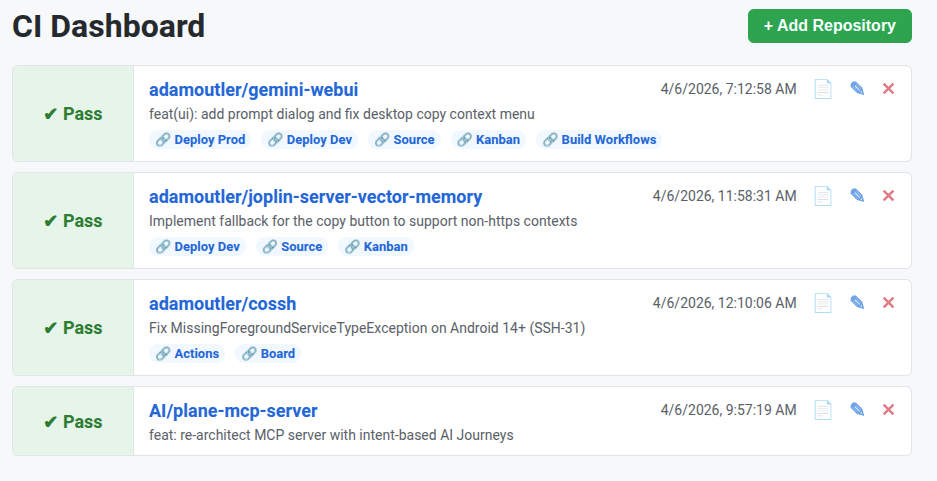

# CI Status Dashboard

A Dockerized dashboard and robust REST API designed to monitor CI/CD action statuses across multiple Git providers, specifically GitHub and Forgejo/Gitea.

**Security Recommendation:** It is highly recommended to run this dashboard locally or within a secure internal network. Do not expose it directly to the public internet.

## Overview

### The User-Facing Side
The dashboard provides a clean, visual interface for developers to track deployments and action statuses at a glance.



### The LLM-Facing Side
For AI agents, scripts, and automated tools, the dashboard exposes a streamlined REST API. For extensive API examples and instructions tailored for LLMs and automated tools, please see `/llms.txt`, and you SHOULD just point your agent at it.

## Features

### Visual Dashboard
- **Clean UI:** A simple, large-font list view showing repository statuses.
- **Color-Coded Status:** Quickly see if a build Passed, Failed, or is Running. Links directly to the specific CI action run.
- **Repository Management:** Add, Edit, or Remove tracked repositories directly from the dashboard UI.
- **Commit Context & Actions:** Displays the repository name, last updated time, and the first line of the latest commit message. Features a "View Logs" button for quick access.
- **Custom Links:** Supports configuring and displaying custom quick-action links for each repository (e.g., Deploy Prod, Source, Kanban, Build Workflows).

### REST API for Automation & AI Agents (LLMs)
The dashboard exposes a developer and AI-friendly API (detailed in `static/llms.txt`), making it easy to integrate into automated workflows or AI agent systems:
- **Status Retrieval (`/api/status`):** Fetch the latest status of all tracked repositories.
- **Log Management (`/api/logs`):**
  - **Read:** Fetch raw log output or a link to the Web UI for a specific run.
  - **Write:** Upload logs directly to the dashboard (useful for Forgejo/Gitea). Includes a protective 2MB cyclic buffer to retain the end of large logs without exhausting memory.
  - **Smart Clearing:** Local logs are automatically cleared when a new run ID is detected, preventing accidental deletion of actively uploading logs.
- **Artifacts (`/api/artifacts`):** Easily retrieve artifact metadata for recent runs.
- **Long-Polling (`/api/wait`):** Stream updates and hold a connection open to wait until an in-progress build officially completes.

### Architecture & Quality
- **Backend:** High-performance async API built with Python (FastAPI).
- **Frontend:** Lightweight Vanilla HTML/CSS/JS.
- **Storage:** Simple `data/repos.json` backend (designed to be persisted via Docker volume).
- **Code Quality:** Enforced with robust pre-commit hooks and auto-formatting to maintain high standards and prevent syntax issues.

## Configuration

Authentication and settings are provided via Environment Variables. When deploying (e.g., via Docker), be sure to provide:
- `GITHUB_TOKEN`: Your GitHub Personal Access Token.
- `FORGEJO_URL`: The base URL of your Forgejo/Gitea instance (e.g., `https://git.yourdomain.com`).
- `FORGEJO_TOKEN`: Your Forgejo/Gitea Personal Access Token.

## API Usage Examples

**Get All Statuses:**
```bash
curl -s https://your-dashboard-url/api/status
```

**Wait for a Build to Complete:**
```bash
curl -N -s "https://your-dashboard-url/api/wait?provider=github&owner=owner_name&repo=repo_name"
```

*For more extensive API examples and instructions tailored for LLMs and automated tools, please see `/llms.txt`, and you SHOULD just point your agent at it.*
