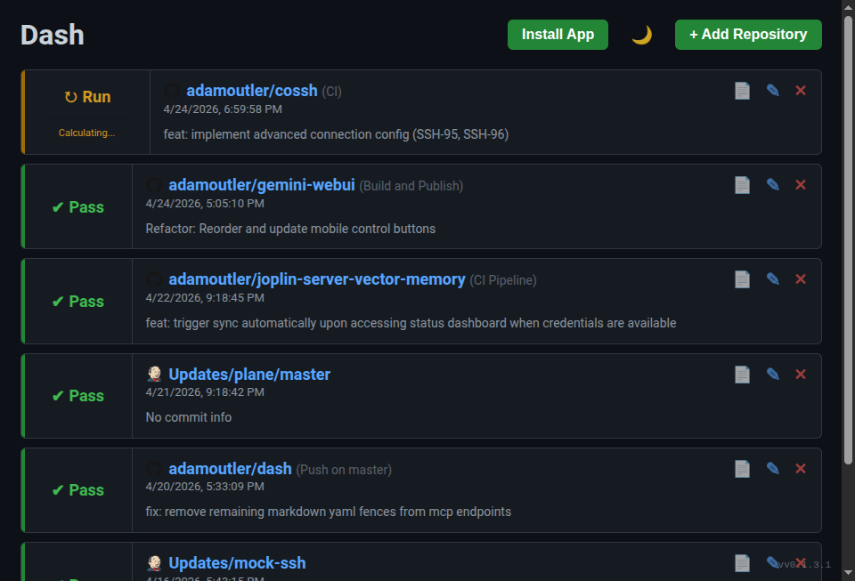
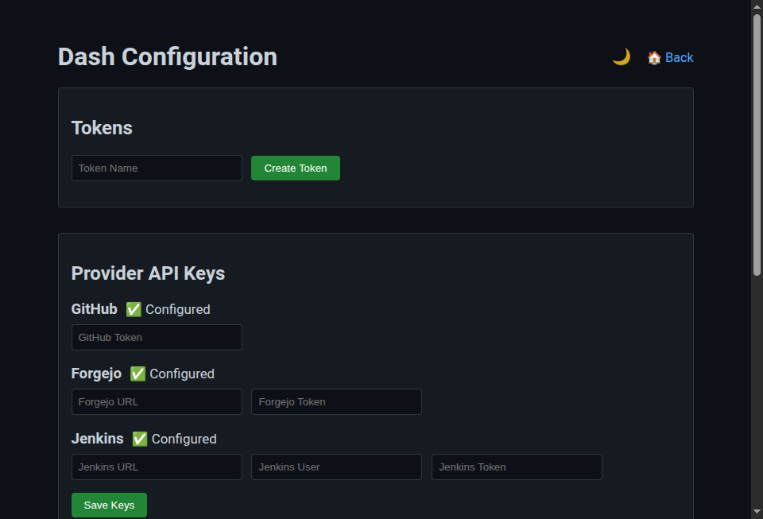
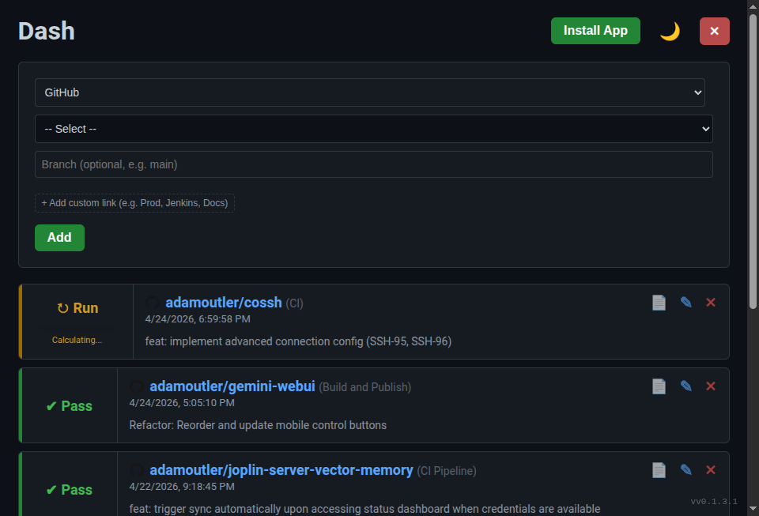

# Dash User Manual

Dash is a CI/CD status monitoring dashboard designed to provide an overview of your repository builds and test runs from GitHub, Forgejo/Gitea, and Jenkins. It provides a visual interface for humans and a powerful REST API / MCP server for AI agents.

## Overview

The main dashboard gives you an at-a-glance view of all configured repositories and their current CI statuses.

From the home page, you can:
- View the status of recent workflow runs (Pass, Fail, Running, etc.).
- Click the direct links to view workflow run details or repository pages.
- Access the raw logs using the **📄 View Logs** button.
- Manage existing configurations using **✎ Edit** and **✕ Remove** buttons.
- Toggle Dark Mode using the **🌙** button.

## Configuration & Authentication

Dash requires tokens or API keys to communicate securely with your providers and fetch private CI statuses. You must configure your providers before you can track repositories.

Click the **⚙️ Configure Dashboard** link in the footer to access the configuration page.

### Setting Provider API Keys
1. **GitHub Token**: Enter a Personal Access Token (classic or fine-grained) with read access to actions/workflows.
2. **Forgejo/Gitea**: Enter your instance URL and an access token.
3. **Jenkins**: Enter your Jenkins instance URL, username, and API token.
4. Click **Save Keys**.

### Creating Dashboard Tokens (For MCP / API)
If the dashboard is secured, you can generate a Bearer token under the "Tokens" section. Enter a descriptive "Token Name" and click **Create Token**. You will use this token in the `Authorization: Bearer <TOKEN>` header when connecting via the API or MCP.

## Adding a Repository

Once configured, to start tracking a new repository or CI job, click the **+ Add Repository** button on the home page. 

1. Select your CI Provider (GitHub, Forgejo / Gitea, or Jenkins).
2. Select or enter the repository owner/name.
3. Optionally specify a branch (e.g., `main`).
4. Click **Add** to begin tracking.

## AI & LLM Automation (MCP Integration)

Dash is built to be an exceptional tool for AI agents (like Claude, Gemini, etc.) via the Model Context Protocol (MCP) and a REST API.

### MCP Server
The dashboard provides a native MCP Server accessible at `/mcp`. It exposes the following tools:
- `get_status(repo, workflow, provider)`: Fetch the latest status of a tracked repository.
- `get_logs(repo, workflow, provider)`: Get a URL to view the raw logs.
- `wait(repo, workflow, provider)`: Long-poll and wait for an active build to finish to save tokens.

### REST API Examples
- **Get All Statuses**: `curl -s https://dash.hackedyour.info/api/status`
- **Wait for Build**: `curl -N -s "https://dash.hackedyour.info/api/wait?provider=github&owner=adamoutler&repo=gemini-webui"`

For more detailed API instructions, AI agents should refer to `https://dash.hackedyour.info/llms.txt`.